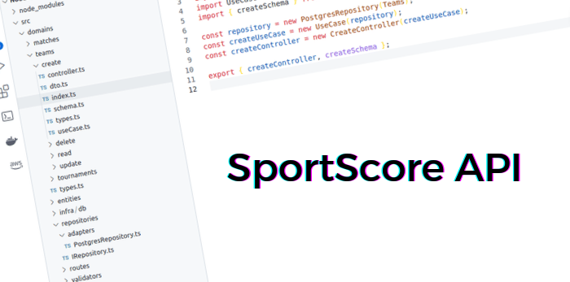

<p align="center">
    <a href="" rel="noopener">
        
    </a>
</p>

<h3 align="center">SportScore API</h3>

<div align="center">

[](https://github.com/preduus/sportscore-api/issues)
[]()
[]()
[](/LICENSE)

</div>

---


## 📝 Table of Contents

- [About](#about)
- [Installing](#installing)
- [Usage](#usage)
- [Built Using](#built_using)
- [Contribute](#contribute)
- [License](#license)

## 🧐 About <a name="about"></a>

The main idea of ​​the project is to facilitate the learning of other languages.
We created a simple AI that will interact with you. Just ask questions that if she knows, she will answer.

We have some basic phrases from Portuguese and English only.

## Prerequisites

What things you need to install the software and how to install them.

* [Docker](https://docs.docker.com/get-docker/)
* [Docker Compose](https://docs.docker.com/compose/install/)


## Installation

We chose to use [docker](https://docs.docker.com/get-docker/) and [docker compose](https://docs.docker.com/compose/install/) to develop this application. If you haven't installed it, you can find the installation steps [here](https://www.digitalocean.com/community/tutorials/how-to-install-and-use-docker-on-ubuntu-20-04-pt).


## 🎈 Usage <a name="usage"></a>

**To see API Documentation, [click here](https://documenter.getpostman.com/view/6161616/UVeJMRTa).**

You just go up the stack and use it. Run:
```bash
$ docker-compose up -d
```

**If you want to test it, just import the [API collection](./collection.json) into Postman.**

You can changes params in [**compose.yml**](compose.yml) file.


## ⛏️ Built Using <a name="built_using"></a>

- [Docker](https://www.docker.com/)
- [Node.js](https://nodejs.org/)
- [Express](https://expressjs.com/)
- [Joi](https://joi.dev/api/)
- [Postgres](https://www.postgresql.org/)
- [Sequelize ORM](https://sequelize.org/)

## ✍️ Authors <a name="authors"></a>

- [Pedro Rodrigues](https://github.com/preduus) - Idea & Initial work

## 📫 Contribute to project <a name="contribute"></a>
The project needs a lot of input for us to add more brokers providers, if you feel like helping or have some idea, please open an [issue](/../../issues) and help us.

1. Fork the project.
2. Create a branch: `git checkout -b feature/<branch_name>`.
3. Commit your code changes: `git commit -m '<message>'`
4. Push to your work branch: `git push origin feature/<branch_name>`
5. Open a pull request.

Alternatively, see on GitHub docs [How to create a pull request](https://help.github.com/en/github/collaborating-with-issues-and-pull-requests/creating-a-pull-request).

## 📝 License <a name="license"></a>

Distributed under the MIT License. See LICENSE for more information.